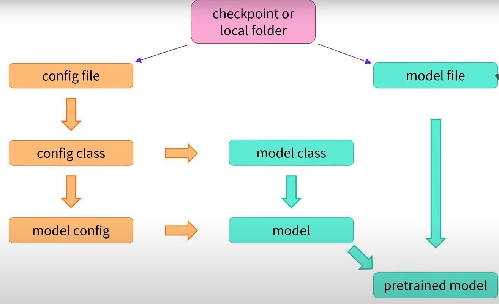

# [HuggingFace NLP Course](https://huggingface.co/learn/nlp-course/chapter1/1)

- [HuggingFace NLP Course](#huggingface-nlp-course)
  - [Pipeline](#pipeline)
  - [Transformer Models](#transformer-models)
    - [General architecture](#general-architecture)
    - [Attention layers](#attention-layers)
  - [Using Transformers](#using-transformers)
    - [Behind the sence](#behind-the-sence)
      - [`AutoTokenizer`](#autotokenizer)
      - [`AutoModel` and `AutoModelFor***`](#automodel-and-automodelfor)
      - [`PostProcessing`](#postprocessing)
    - [Create, load and save a transformer](#create-load-and-save-a-transformer)
    - [Using a Transformer model for inference](#using-a-transformer-model-for-inference)
  - [Datasets](#datasets)
  - [Tokenizers](#tokenizers)

## Pipeline

The pipeline function returns an end-to-end obenct that performs an NLP task on one or several texts

`Pre-Processing` => `Model` => `Post-Processing`

You can pipeline API with the default model associated to each task, but you can use it with any model that has been pretrained or fine-tuned on this task.

Common usecase examples:

1. Text classification/ Zero-shot classification

```python
pipeline("sentiment-analysis")
```

2. Text generation

```python
pipeline("text-generation")
```

3. Text completion (guess the value of the masked word)

```python
pipeline("fill-mask")
```

4. Token calssification (classify each word in the sentence instead of the sentence as a whole)

e.g. Named Entity Recognition

```python
pipeline("ner", grouped_entities=True)
```

5. Question answering

```python
pipeline("question-answering")
```

6. Summarization

```python
pipeline("sumarization")
```

7. Translation

```python
pipeline("translation", model="Helsink-NLP/opus-mt-fr-en")
```

## Transformer Models

- GPT like (*auto-regression* Tansformer models)
- BERT like (*auto-encoding*)
- BART/T5 like (*sequence-to-sequence*)

Above are language models. They have been trained on large amount of raw text in a self-supervised fashion. Self-supervised learning: objective is automatically computed from the inpurts of the model. Humans are not needed to label the data!

e.g. ImageNet is comonly used as a dataset to pretraining models in computer vision

Still need to go through `transfer learning` so the model will be fine-tuned in a supervised way (using human annotated labels). Transfer learning is applied by dropping the head of the pretrained model while keeping its body. 

Pretraining + Fine-tuning

### [General architecture](https://youtu.be/H39Z_720T5s)

Transforers consists of `Encoder` and `Decoder`.

1. The `encoder` encodes test into numerical representations (make sense of inputs)

- the numerical representations are also called as **embeddings** or **features** (*feature vector*, *feature tensor*).  
- **bi-directional** properties: context from the left, and the right
- use **self-attention** mechanism: Each word in the initial squence affects every word's representation. The representation contains the value of the word, and contextualized (the words around it). Different positions or different words in sequance will affect the represenation. 

Example of encoders: `BERT`, `RoBERTa`

Example of use cases: guess masked words; sentiment analysis

2. The `decoder` decodes the represetnations from the encoder. It can also accepts text inputs (generate outputs)

- use **masked self-attention** + **cross-attention** mechanism
- **uni-directional** property: words can only see the words on the left side; the right side is hidden
- used in an **auto-regressive** manner: at each stage, for a given word, the attention layers can only access the words positioned *before* it in the sentences

Example of decoders: `GPT`, `GPT2`, `CTRL`, `Transformer XL`

Example of use cases: causal language modeling (guessing the next word in a sentence)

3. Encoder-decoder transformers == Sequence-to-sequence transformers

Decoder are give the output of the encoder, and a sequence (start of sequence word)

Example of seq-to-seqs: `BART`, `mBART`, `Marian`, `T5`

Example of use cases: summarization, translation, generative question answering

### Attention layers

A word's meaning is deeply affected by the context (words before or after the targe word).

## Using Transformers

### Behind the sence

Tokenize => Model => PostProcessing

- Tokenize: RawText => InputIDs
- Model: InputIDs => logits
- PostProcessing: logits => Predictions

#### `AutoTokenizer`

Preprocessing step

Generate `inputs_ids` and `attention_mask`

#### `AutoModel` and `AutoModelFor***`

`AutoModel` generate *hidden states*/ *features*. 

*Hidden states* can also be input to another part of the model, known as the *head*.

This is a high-dimensional vector representing the contextual understanding of that input by the Transformer model: 
- batch size
- sequence length
- hidden size

**Model Heads**

e.g. 

Model input => Embeddings => Layer(s) => Hidden states => Head => Model output

Embeddings => Layer(s): Transformer network
Embeddings => Layer(s) => Hidden states => Head: Full model

- `AutoModel` will generate Hidden states
- `AutoModelForXYZ` will generate head

Model output is `logits`, the raw, unnormalized scores.

#### `PostProcessing`

To be converted to probabilities, the logits need to go through a `SoftMax` layer.

The loss function will be generated here. 

PostProcessing will create predictions

### Create, load and save a transformer



`AutoModel` returns the correct architecture based on the checkpoint. It can automatically guess the appropriate model architecture for your checkpoint, and then instantiates a model with this architecture.

But we can also specify which architecture directly. 

```python
from transformers import BertConfig, BertModel

# build the model from scratch
config = BertConfig()
model = BertModel(config)

# load a pre-trained mode
model = BertModel.from_pretrained("bert-base-cased")  # instead of AutoModel here
# this will produces checkpoint-agnostic code

# save, generate `config.json` and `pytorch_model.bin` (the state dictinoary)
model.save_pretrained("directory_on_my_computer")
```

The configuration is necessary to know your model’s architecture, while the model weights are your model’s parameters.

### Using a Transformer model for inference

```python
import torch
model_inputs = torch.tensor(encoded_sequences)
```

## Datasets

Datasets is a library for easily accessing and sharing datasets for Audio, Computer Vision, and Natural Language Processing (NLP) tasks.

[Load a dataset from the Hub](https://huggingface.co/docs/datasets/load_hub)

[Proprocess](https://huggingface.co/docs/datasets/use_dataset)

Sometimes you may need to rename a column, and other times you might need to unflatten nested fields.


## [Tokenizers](https://youtu.be/VFp38yj8h3A?si=GD7nYxwRkGjZyb4I)

The tokenzier's objective is to find a meaningful representation

1. Word based
    * very large vocabularies
    * large quntity of out-of-vacabulary tokens
    * loss of meaning across very similar words
2. Char based
    * very long sequences
    * less meaningful individual tokens
3. Subword based (most popular)
    * Frequently used words should not be split into smaller subwords
    * Rare words should be decomposed into meaningful subwords
    e.g. `dog` =X=> `d`, `o`, `g`, `dogs` => `dog`, `s`
